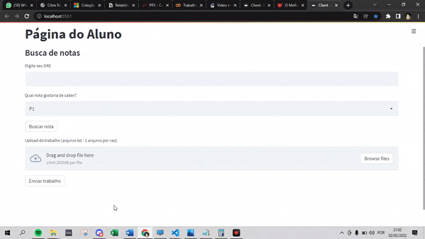
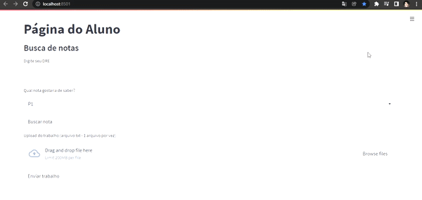

# protocolo_de_transporte

## Como rodar a aplicação

1. Com o repositório clonado, instale as dependências necessária com o comando "pip install -r requirements.txt".
2. Primeiro rode o server com "py server.py" ou "python server.py" dependendo da sua versão de python
3. Depois, em outro cmd, execute o comando "streamlit run client.py"
4. Caso o browser não abra automaticamente, acesse a aplicação na url http://localhost:8501/

## Casos de Uso

### Enviando trabalho pela aplicação

Para enviar um trabalho é só preencher o campo corespondente, escolher a prova e clicar no botão de "Buscar Nota".
Para ter um dre correspondente, pode utilizar o seguinte: 11905384

### Requisitando nota pela aplicação

Para enviar o trabalho, arraste um arquivo txt para o campo "drag and drop file here" e clique no botão "Enviar trabalho"

Autores: Filipe Braga, Heitor Abreu e Wesley Jupter